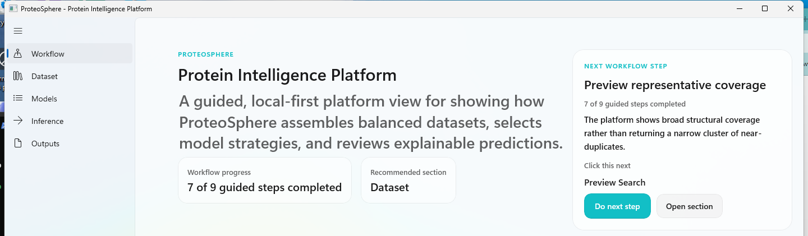

# ProteoSphere

ProteoSphere is a local-first protein intelligence platform for building trustworthy biological machine learning datasets, structural graph packages, and explainable modeling workflows.

The project is designed to overcome the limitations of many small-scale protein ML studies:

- narrow hand-built datasets
- weak provenance and cross-source reconciliation
- train/test leakage from random or shallow split strategies
- one-off graph choices treated as universal
- workflows that are difficult to inspect, explain, or share with collaborators

ProteoSphere addresses those problems with a broader and more deliberate approach:

- local source packaging with explicit refresh, retention, and targeted-update strategy
- canonical planning and identity layers for proteins, ligands, and pair records
- decision-grade field auditing before screening logic can rely on a field
- representative training-set construction instead of narrow duplicate-heavy selection
- leakage-resistant split governance
- support for multiple graph scopes and structural representations
- model recommendation and training paths tied to real workspace evidence
- a polished WinUI desktop shell that explains the workflow on screen

## Project Aims

ProteoSphere is being built to:

- pre-populate and manage broad biological source data under a user-selected local root
- curate representative protein interaction datasets with strong provenance
- support multiple structural graph designs for downstream modeling
- build training/validation/test splits that are more scientifically defensible
- compare model paths honestly based on actual dataset and runtime readiness
- make the full workflow understandable to scientific collaborators, not just developers

## Core Strategy

The platform is organized as a set of cooperating layers rather than a single script:

1. Source packaging
   - Stage local snapshots from structural, affinity, annotation, and pathway sources.
2. Bootstrap planning
   - Build a fast local index of PDB-linked facts for coverage review, candidate planning, and targeted refresh.
3. Extraction and normalization
   - Parse structures, assays, interfaces, and metadata into a coherent local schema.
4. Screening and field audit
   - Populate and validate decision-grade fields before they influence curation or split policy.
5. Training-set design
   - Select representative, diverse examples while limiting cluster dominance and source bias.
6. Split governance
   - Build pair-aware, leakage-resistant train/validation/test partitions.
7. Graph and feature packaging
   - Export multiple graph designs and engineered feature views aligned with the selected data.
8. Model review and inference
   - Recommend, train, compare, and inspect suitable model paths and saved-model predictions.

## Graph Design Philosophy

ProteoSphere is intentionally not locked to one graph worldview. The platform is structured to support:

- whole-protein graphs
- interface-only graphs
- shell / neighborhood graphs
- residue-level graphs
- atom-level graphs
- protein-ligand graphs
- protein-protein interface graphs
- multimodal packaging that combines structure, assay, and metadata context

That flexibility matters because different biological questions require different structural contexts.

## Training-Set And Split Philosophy

The goal is not just to maximize row count. The goal is to build datasets that are more likely to generalize.

ProteoSphere therefore prioritizes:

- representative candidate selection over near-duplicate clusters
- explicit quality and provenance signals
- sequence/family-aware grouping instead of naive row splits
- mutation-cluster-aware and source-aware governance
- visible split assignments and screening logic in exported artifacts

## Why This Is Stronger Than Typical Small-Scale Efforts

Compared with many common protein ML workflows, ProteoSphere is designed to offer:

- broader source coverage
- better provenance and source conflict handling
- more defensible split policy
- more reusable graph and feature packaging
- a more interpretable path from curation to training to inference
- better usability for collaborative scientific review

## Primary Desktop Experience

The preferred presentation surface is the WinUI desktop app under [`apps/PbdataWinUI`](apps/PbdataWinUI).

Current presentation shell:



## Quick Start

### 1. Clone and install

```powershell
git clone https://github.com/jfvitas/bio-agent-lab.git
cd bio-agent-lab
python -m venv .venv
.venv\Scripts\activate
pip install -e ".[dev]"
```

### 2. Launch the WinUI app

Primary launcher:

```powershell
.\Launch ProteoSphere WinUI.bat
```

Compatibility launcher:

```powershell
.\Launch PBData WinUI.bat
```

### 3. Run a quick repo smoke check

```powershell
.\Run ProteoSphere Smoke Check.bat
```

## Presentation Materials

The current project overview deck is available at:

- [ProteoSphere_platform_strategy_overview_2026-03-17.pptx](ProteoSphere_platform_strategy_overview_2026-03-17.pptx)

## Important Note On Current Naming

The public-facing product name is now **ProteoSphere**.

Some internal code paths, Python package names, and CLI commands still use the historical `pbdata` name while the deeper rebrand is completed. For example:

- Python package: `pbdata`
- CLI entry points: `pbdata ...`
- WinUI project path: `apps/PbdataWinUI`

That is a naming transition issue, not a product-scope issue.

## Repository Structure

- [`apps/PbdataWinUI`](apps/PbdataWinUI): WinUI desktop shell
- [`src/pbdata`](src/pbdata): core pipeline, adapters, dataset logic, modeling, and CLI
- [`docs/roadmap_to_fully_usable_platform.md`](docs/roadmap_to_fully_usable_platform.md): execution roadmap
- [`docs/presentations`](docs/presentations): presentation assets and generated decks
- [`AGENTS.md`](AGENTS.md): development rules and priorities

## Validation

For the current workspace, we have been validating with:

- focused regression tests
- repo smoke checks
- WinUI build and launch verification
- artifact inspection
- explicit distinction between curated presentation state and live functional state

## License / Data Notes

This repository includes tooling for working with multiple public and locally staged biological data sources. Some source datasets have their own licensing or redistribution constraints. In particular, licensed local packages such as PDBbind should be handled according to their source terms.
